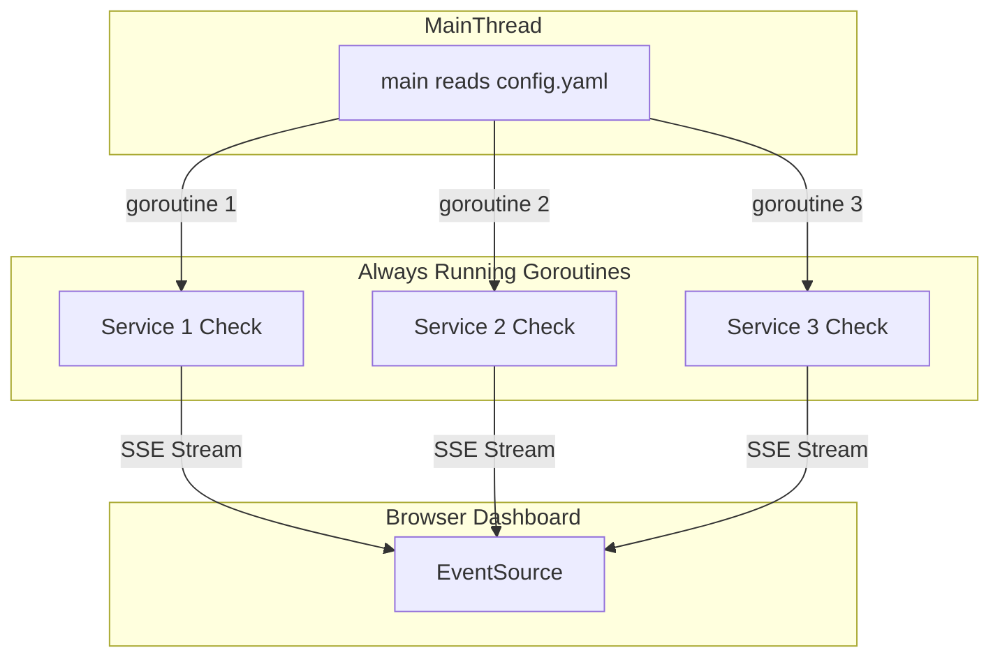

<h1 align="center"> in⧕idents </h1>

Inxidents is a minimal configuration, open-source incident management software with alerts and dashboard for your HTTP/S services written in Go.

**Current Features:**
- Real-time (SSE) Health Dashboard of your services. Perfect for office screens or similar environments.
- Slack Alerts whenever a service goes down.
- Visually see when the next healthcheck will occurr (the white progressbar)
- Small project with simple configuration. Easy to hack and further extend for your needs.

**Upcoming features:**
- Acknowledgement Button for down services so alerts stop. 
- Add POST checks, and "expectedString" configuration for more functional testing.
- Recovered Alert
- ... ideas and suggestions are welcome

# Demo
[Click for Demo Dashboard](https://incidents.fly.dev/)


# Installation / Deployment
1. ```cp config.dev.yaml config.yaml```
2. Change config.yaml accordingly and add your services:
Sample service: 
```
- name: Google
  endpoint: https://www.google.com
  frequency: 1m
  expectedCode: 200
```
- **Name**: Name of service, currently it needs to be unique for each service you check. 
- **Endpoint**: HTTP/S endpoint
- **Frequency**:  Frequency of the health check, examples: "300ms", "2h45m". Valid time units are "ns", "us" (or "µs"), "ms", "s", "m", "h".
3. To get Slack alerts, make sure the app has access to an environmental variable called **SLACK_WEBHOOK_URL** containing the incoming slack webhook url. [More info on it here](https://api.slack.com/messaging/webhooks)

## Deploy on fly.io
1. Install [flytcl](https://fly.io/docs/hands-on/install-flyctl/)
2. Run ```flyctl launch```(answer no to DB or Volume creations)
3. Run ```flyctl deploy``` to deploy

To receive Slack alerts when deploying to fly.io you can add the SLACK_WEBHOOK_URL in the fly.toml file
```
[env]
   SLACK_WEBHOOK_URL = "YOUR INCOMING SLACK WEBHOOK URL"
```

## Other deployment methods
You can deploy it via docker as it is containarized or if you get the self-contained binary, you can use systemd to keep the process running.

TODO: Needs more documentation here.


## Tech comments / Architecture
There is no database by design for the time being (if needed in the future, it will likely be SQLite). Apart from the configuration file everything else happens in-memory. The only persistent data history (downtimes history) can be found on Slack alerts and application log files. 


