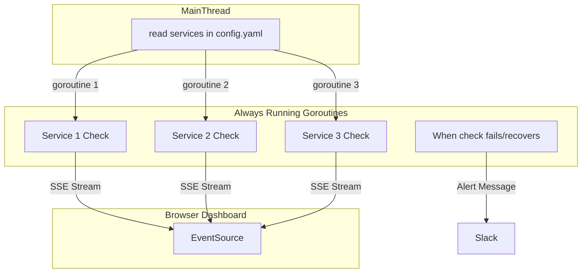

<h1 align="center"> in⧕idents </h1>
<div align="center"><p>
    <a href="https://github.com/piqoni/inxidents/pulse">
      
    </a>
    <a href="https://github.com/piqoni/inxidents/blob/main/LICENSE">
      
    </a>
    <a href="https://github.com/piqoni/inxidents/stargazers">
      
    </a>
</div>
Inxidents is a minimal configuration, open-source incident monitoring software with alerts and dashboard for your HTTP/S services written in Go.
<p align="center">
    </img>
</p>

**Current Features:**
- **Real-time (SSE) Health Dashboard** of your services. Perfect for office screens or similar environments.
- **Slack Alerts** whenever a service goes down 🟥 and recovers 🟩.
- **ACK** feature (acknowledge a down service will stop further notifications and will display corresponding service with red and black pattern 🚧)
<!--  -->
- Types of checks: GET/POST, StatusCode, containsString (check if certain text is in the response body)
- Visually see the **frequency** of the healthcheck (the white progressbar animation)
- Small project with **simple configuration**. Easy to hack, deploy and further extend for your needs.


**Upcoming features:**
- Private/unique URLs for dashboards
- ... ideas and suggestions are welcome

# Demo
[Click for Demo Dashboard](https://inxidents.fly.dev/)


# Installation / Deployment
1. ```cp config.dev.yaml config.yaml```
2. Change config.yaml accordingly and add your services:
Example configuration of one service: 
```
- name: Google
  endpoint: https://www.google.com
  frequency: 1m
  expectedCode: 200
```
- **name**: Name of service, currently it needs to be unique for each service you check. 
- **endpoint**: HTTP/S endpoint
- **frequency**:  Frequency of the health check, examples: "300ms", "2h45m". Valid time units are "ns", "us" (or "µs"), "ms", "s", "m", "h".
- **expectedCode**: This is the expected http status code returned from the endpoint. 
- **httpMethod**: OPTIONAL - write POST if you are testing POST http Methods. 
- **containsString**: OPTIONAL - Check if given string exists in the response body. Value type, string: "FAQ" 
- **disableAlerts**: OPTIONAL - For some services one might want only the dashboard and not alerts, set true to those, default is false. 
3. To get Slack alerts, add an environmental variable called **SLACK_WEBHOOK_URL** containing the incoming slack webhook url. [More info on it here](https://api.slack.com/messaging/webhooks)

## Deploy on fly.io
1. Install [flytcl](https://fly.io/docs/hands-on/install-flyctl/)
2. Run ```flyctl launch```(answer no to DB or Volume creations)
3. Run ```flyctl deploy``` to deploy

To enable Slack alerts when deploying to fly.io you can add the SLACK_WEBHOOK_URL in the fly.toml file
```
[env]
   SLACK_WEBHOOK_URL = "YOUR INCOMING SLACK WEBHOOK URL"
```

## Deploy using Docker
Pull [inxidents image](https://hub.docker.com/r/piqoni/inxidents) from dockerhub:
```
docker pull piqoni/inxidents
```

Create a directory anywhere in you system and then put your inxidents [config.yaml](https://github.com/piqoni/inxidents/blob/main/config.dev.yaml) file, for example `MYDIR/config.yaml`.

Run the container (-e SLACK_WEBHOOK_URL is optional, only if you want alerts):
```
docker run \
  -p 8080:8080 \
  -v /PATH/TO/YOUR/MYDIR:/app \
  -e SLACK_WEBHOOK_URL=YOUR_SLACK_WEBHOOK_URL_HERE \
  piqoni/inxidents
```
Access the dashboard on http://localhost:8080

## Tech comments / Architecture
There is no database by design for the time being (if needed in the future, it will likely be SQLite). Apart from the configuration file everything else happens in-memory. The only persistent data history (downtimes history) can be found on Slack alerts and application log files. 


